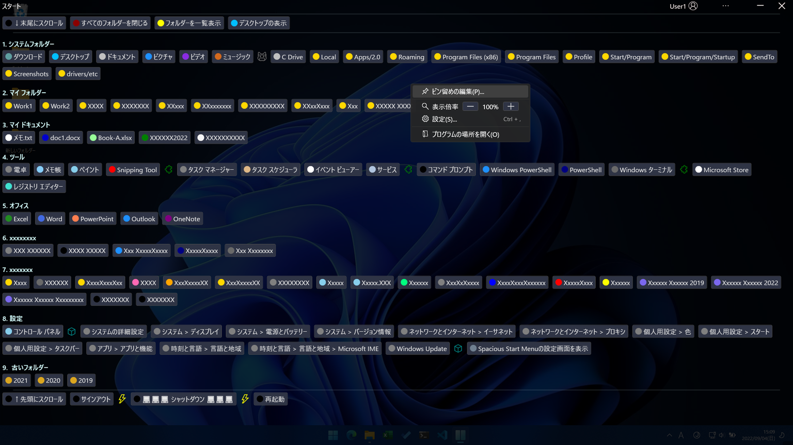

# 目次

- **概要**
- **要件**
- [インストール](install-ja.md)
- [バージョンアップ](update-ja.md)
- [アンインストール](uninstall-ja.md)
- [使い方](usage-ja.md)
- [その他](other-ja.md)
  - お勧め設定
  - 参考資料

# 概要

これは、画面領域全体を活用できるプログラムランチャーです。

フルスクリーンで一覧できるため、ユーザーは煩雑なスクロール操作から解放されます。

このプログラムはスタートメニューを置き換えるものではありませんが、使い込むほどスタートメニューの使用頻度が減っていくはずです。

### なぜ全画面?

ユーザーが「アプリケーションを起動する」というタスクをこなすために「起動の候補」以外の情報が見えている必要性は低いです。

そのため、スクリーン全体に選択肢が展開されるようになっています。

# 要件

- Windows10以降
- .NET6 デスクトップ ランタイム

---

| 目次・概要 | [インストール](install-ja.md) | [アップデート](update-ja.md) | [アンインストール](uninstall-ja.md) | [使い方](usage-ja.md) | [その他](other-ja.md) |
