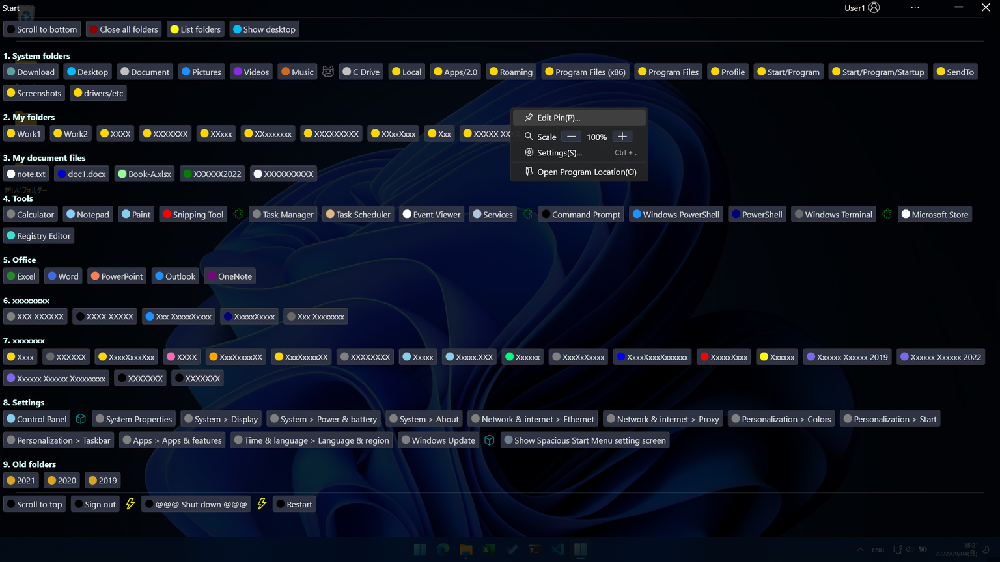

# Index

- **Overview**
- **Requirements**
- [Install](install.md)
- [Update](update.md)
- [Uninstall](uninstall.md)
- [Usage](usage.md)
- [Other](other.md)
  - Recommended initial settings
  - Reference article

# Overview

This is a program launcher that allows you to take advantage of the entire screen area.

The full screen listing frees the user from cumbersome scrolling operations.

This program will not replace the `Start Menu`, but the more you use it, the less often you should use the `Start Menu`.

### Why full screen?

It is unlikely that users need to see any information other than "candidate for launch" in order to perform the task of "launching an application".

Therefore, the choices are deployed across the entire screen.

# Requirements

- Windows 10 or later
- .NET 6 Desktop Runtime

---

| Index | [Install](install.md) | [Update](update.md) | [Uninstall](uninstall.md) | [Usage](usage.md) | [Other](other.md) |

