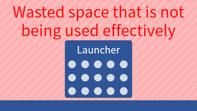

# Index

- **Overview**
- **Requirements**
- [Install](install.md)
- [Update](update.md)
- [Uninstall](uninstall.md)
- [Usage](usage.md)
- [Other](other.md)
  - Recommended initial settings
  - Reference article

# Overview

This is a program launcher that allows you to take advantage of the entire screen area.

The full screen listing frees the user from cumbersome scrolling operations.

This program will not replace the `Start Menu`, but the more you use it, the less often you should use the `Start Menu`.

### Why full screen?

What the user wants to see in order to accomplish the task of **launching an application** is a list of **candidate applications to launch**, and there is little need for any other information to be visible.

Therefore, the choices are deployed across the entire screen so that more information is visible at once.

# Requirements

- Windows 10 or later
- .NET 6 Desktop Runtime

---

| Index | [Install](install.md) | [Update](update.md) | [Uninstall](uninstall.md) | [Usage](usage.md) | [Other](other.md) |

---

[Japanese](index-ja.md)
