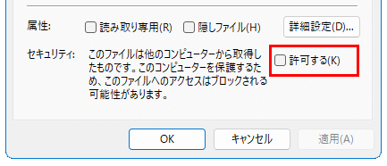

# インストール

## ステップ1

Download and install `x64` of `.NET Desktop Runtime 6.x` from [Download .NET 6.0 (Linux, macOS, and Windows)](https://dotnet.microsoft.com/download/dotnet/6.0).

## ステップ2

### 💠手動インストールの場合

[Releases](https://github.com/3xKEsGJQsmEQLAfuMv9QikF8i9y7Bf1D6NjguXg/spacious-start-menu/releases)から`SpaciousStartMenu.zip`をダウンロードします。

zipを右クリック、`プロパティ`を選択して、`許可する`にチェックを入れ、`OK`ボタンで閉じます。


  
zipを解凍し、管理者権限を必要としない任意の場所に配置します。

### 💠Scoopを使用したインストールの場合

#### Scoopのインストール

省略

#### bucketの追加

以下のコマンドを実行します。

```
scoop bucket add 3xkesg https://github.com/3xKEsGJQsmEQLAfuMv9QikF8i9y7Bf1D6NjguXg/scoop-3xke
```

#### アプリのインストール

以下のコマンドを実行します。

```
scoop install spacious-start-menu
```

---

| [目次・概要](index-ja.md) | インストール | [アップデート](update-ja.md) | [アンインストール](uninstall-ja.md) | [使い方](usage-ja.md) | [その他](other-ja.md) |


