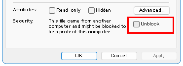

## Install

### Step 1

Download and install `x64` of `.NET Desktop Runtime 6.x` from [Download .NET 6.0 (Linux, macOS, and Windows)](https://dotnet.microsoft.com/download/dotnet/6.0).

### Step 2

<details open>
<summary>💠For manual installation</summary>

Download `SpaciousStartMenu.zip` from [Releases](https://github.com/3xKEsGJQsmEQLAfuMv9QikF8i9y7Bf1D6NjguXg/spacious-start-menu/releases).

Right-click on the zip, select Properties, check `Unblock` and close with the OK button.


  
Extract the zip and place it in any location that does not require administrative privileges.
</details>

<details>
<summary>💠For installation using Scoop</summary>

**🔹Scoop installation**

omit

**🔹Add bucket**

Execute the following command.

```
scoop bucket add 3xkesg https://github.com/3xKEsGJQsmEQLAfuMv9QikF8i9y7Bf1D6NjguXg/scoop-3xke
```

**🔹Install the app**

Execute the following command.

```
scoop install spacious-start-menu
```
</details>

---

[Back](index.md)
