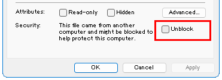

## Install

### 🔷Step 1

Download and install `x64` of `.NET Desktop Runtime 10.x` from [Download .NET 10.0](https://dotnet.microsoft.com/download/dotnet/10.0).

### 🔷Step 2

#### 💠For manual installation

Download `SpaciousStartMenu.zip` from [Releases](https://github.com/3xKEsGJQsmEQLAfuMv9QikF8i9y7Bf1D6NjguXg/spacious-start-menu/releases).

Right-click on the zip, select Properties, check `Unblock` and close with the OK button.


  
Extract the zip and place it in any location that does not require administrative privileges.


#### 💠For installation using Scoop (per user)

##### 🔹Scoop installation

[See here](https://scoop.sh/)

##### 🔹Install the git

If you don't have Git installed, execute the following command.

```
scoop install git
```

##### 🔹Add bucket

Execute the following command.

```
scoop bucket add 3xkesg https://github.com/3xKEsGJQsmEQLAfuMv9QikF8i9y7Bf1D6NjguXg/scoop-3xke
```

##### 🔹Install the app

Execute the following command.

```
scoop install spacious-start-menu
```

#### 💠For installation using Chocolatey (common to all users)

##### 🔹Chocolatey installation

[See here](https://chocolatey.org/install)

##### 🔹Install the app

Execute the following commands as administrator.

```
choco install spacious-start-menu
```

---

| [Index](index.md) | Install | [Update](update.md) | [Uninstall](uninstall.md) | [Usage](usage.md) | [Other](other.md) |


