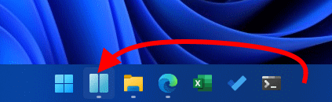

## お勧め設定

タスクバーアイコンを左端の位置に移動します。

タスクバーにピン留めします。

これで`Win` + `1`のショートカットキーでランチャーを起動またはアクティブにできるため、スタートメニューに近い呼び出し方ができます。

---

| [目次・概要](index-ja.md) | [インストール](install-ja.md) | [アップデート](update-ja.md) | [アンインストール](uninstall-ja.md) | [使い方](usage-ja.md) | その他 |
