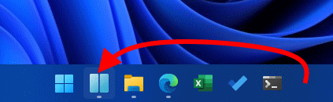
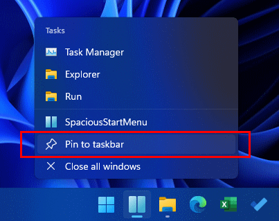

## Recommended initial settings

Move the taskbar icon to the leftmost position.

Pin it to the taskbar.

Now you can use the `Win` + `1` shortcut key to launch or activate the launcher, which is similar to the way the Start menu is called up.

---

| [Index](index.md) | [Install](install.md) | [Update](update.md) | [Uninstall](uninstall.md) | [Usage](usage.md) | Other |
