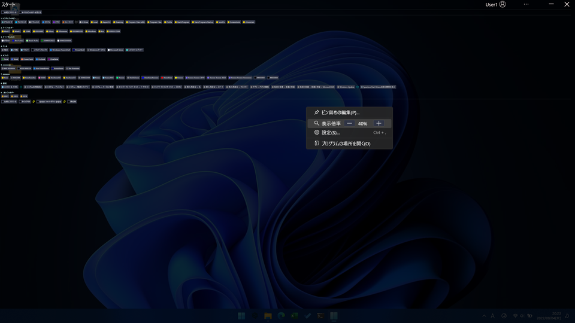
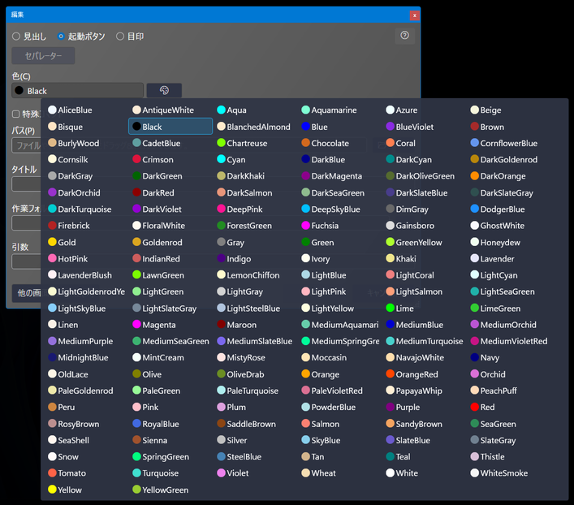
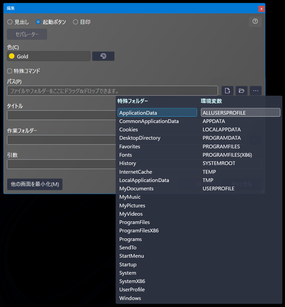
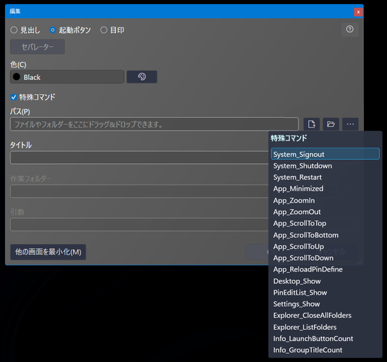

# 使い方

`SpaciousStartMenu.exe` を起動します。

画面を右クリックし、 `ピン留めの編集` を選択して定義を追加します。

ボタンをクリックすると、アプリケーションやフォルダなどを起動できます。

- [メイン画面](#メイン画面)
- [ピン留め定義一覧画面](#ピン留め定義一覧画面)
- [ピン留め編集画面](#ピン留め編集画面)
- [設定画面](#設定画面)

## 🔷メイン画面

起動ボタンを押すことでフォルダを開いたりプログラムを起動することができます。

実行プログラムの場合は `Ctrl` + `Shift` キーを押しながら起動ボタンを押すことで管理者として実行できます。

### 💠コンテキストメニュー

タイトルバーの `...` ボタンや、起動ボタン以外の余白部分を右クリックすると表示されます。

| メニュー項目             | 説明                                          |
| --------------------- | ---------------------------------------------------- |
| ピン留めの編集              | ピン留め定義一覧画面を表示します。 |
| 表示倍率                 | ボタン等の表示倍率を変更します。メイン画面上で `Ctrl` + マウスホイール回転でも変更できます。        |
| 設定              | 設定画面を表示します。                        |
| プログラムの場所を開く | このプログラムが配置されているフォルダを開きます。       |
| プログラムの場所を開いて終了 | このプログラムが配置されているフォルダを開き、プログラムを終了します。このメニュー項目は、設定で有効化できます。       |

### 💠拡大/縮小

コンテキストメニューの `+`, `-` ボタンや、`Ctrl` キーを押しながらマウスホイール回転で表示内容を拡大/縮小できます。

#### 拡大

#### 縮小

## 🔷ピン留め定義一覧画面

コンテキストメニューの `ピン留めの編集` で表示される一覧画面です。

一覧をダブルクリックするか、右端の編集アイコンをクリックするか、 `行の追加` ボタンをクリックして編集画面を開きます。

右端の削除（ごみ箱）アイコンを選択するか `Delete` キーを押した場合、 `保存` ボタンが押されたタイミングで実際の削除が行われます。

## 🔷ピン留め編集画面

個々の定義の編集画面です。

`見出し` 選択時は `タイトル` のみ入力可です。
グループ間を分割する線を引きたい場合は、 `見出し` を選択した状態で、 `セパレーター` ボタンを押してください。 `タイトル` にセパレーターとして認識される文字列 `--------------------` が設定されます。

`パス` はドラッグ&ドロップでファイルやフォルダーを指定することや、特殊フォルダーや環境変数を使用することもできます。

`作業フォルダー` と `引数` は任意入力です。

色選択メニューです。

特殊フォルダー・環境変数選択メニューです。

`特殊コマンド` を選択すると、アプリケーション起動ではない、いくつかのコマンドが選択可能になります。選択肢からコマンドを選択すると `タイトル` も自動で設定されますが、後から任意の名前に変更可能です。

## 🔷設定画面

---

| [目次・概要](index-ja.md) | [インストール](install-ja.md) | [アップデート](update-ja.md) | [アンインストール](uninstall-ja.md) | 使い方 | [その他](other-ja.md) |

