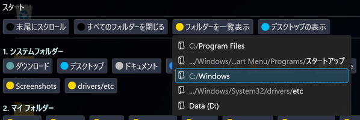
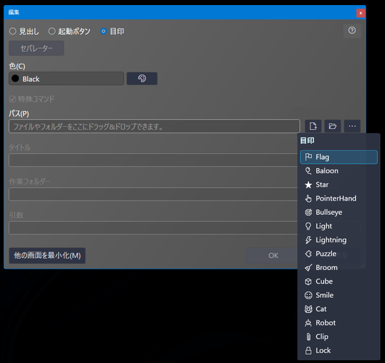
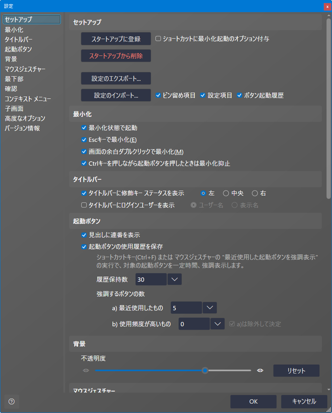

## 使い方

`SpaciousStartMenu.exe` を起動します。初回起動時にサンプルの起動ボタン定義が生成されます。

画面を右クリックし、 `ピン留めの編集` を選択して起動ボタン定義を編集します。この作業が**スタートメニュー**のピン留めに相当します。

起動ボタンをクリックすると、アプリケーションやフォルダなどを起動できます。

- [メイン画面](#メイン画面)
- [ピン留め定義一覧画面](#ピン留め定義一覧画面)
- [ピン留め編集画面](#ピン留め編集画面)
- [設定画面](#設定画面)

### 🔷メイン画面

#### 💠概要

起動ボタンを押すことでフォルダを開いたりプログラムを起動することができます。

実行プログラムの場合は `Ctrl` + `Shift` キーを押しながら起動ボタンを押すことで管理者として実行できます。

#### 💠コンテキストメニュー

タイトルバーの `...` ボタンや、起動ボタン以外の余白部分を右クリックすると表示されます。

| メニュー項目             | 説明                                          |
| --------------------- | ---------------------------------------------------- |
| ピン留めの編集              | ピン留め定義一覧画面を表示します。 |
| 表示倍率                 | ボタン等の表示倍率を変更します。メイン画面上で `Ctrl` + マウスホイール回転でも変更できます。        |
| 設定              | 設定画面を表示します。                        |
| プログラムの場所を開く | このプログラムが配置されているフォルダを開きます。       |
| プログラムの場所を開いて終了 | このプログラムが配置されているフォルダを開き、プログラムを終了します。このメニュー項目は、設定で表示/非表示を切り替えられます。       |

#### 💠タイトルバー

##### 🔹修飾キー ステータス

`Ctrl` や `Shift` などの修飾キーを押している間、押しているキーで有効なモードを表示します。
設定画面で表示/非表示や表示位置を切り替えられます。

##### 🔹ログイン ユーザー

現在ログイン中のユーザーを表示します。設定画面で表示/非表示を切り替えられます。
クリックするとサインアウト、シャットダウン、再起動ができます。

#### 💠拡大/縮小

コンテキストメニューの `+`, `-` ボタンや、`Ctrl` キーを押しながらマウスホイール回転で表示内容を拡大/縮小できます。

##### 🔹拡大

Spacious Start Menuの最大表示

##### 🔹縮小

Spacious Start Menuの最小表示

### 🔷ピン留め定義一覧画面

コンテキストメニューの `ピン留めの編集` で表示される、起動ボタンなどの一覧画面です。

一覧をダブルクリックするか、一覧右端の編集アイコンをクリックするか、下の `行の追加` ボタンまたは `行の編集` ボタンをクリックして編集画面を開きます。

右端の削除（ごみ箱）アイコンを選択するか `Delete` キーを押した場合、 `保存` ボタンが押されたタイミングで実際の削除が行われます。

### 🔷ピン留め編集画面

#### 💠概要

個々の定義の編集画面です。

`見出し` 選択時は `タイトル` のみ入力可です。
グループ間を分割する線を引きたい場合は、 `見出し` を選択した状態で、 `セパレーター` ボタンを押してください。 `タイトル` にセパレーターとして認識される文字列 `--------------------` が設定されます。

`パス` はドラッグ&ドロップでファイルやフォルダーを指定することや、特殊フォルダーや環境変数を使用することもできます。

`作業フォルダー` と `引数` は任意入力です。

#### 💠色

色選択メニューです。

#### 💠特殊フォルダー・環境変数

特殊フォルダー・環境変数選択メニューです。

- [特殊フォルダー 一覧](table-ja.md#特殊フォルダー)
- [環境変数 一覧](table-ja.md#環境変数)

#### 💠特殊コマンド

`特殊コマンド` を選択すると、アプリケーション起動ではない、いくつかのコマンドが選択可能になります。選択肢からコマンドを選択すると `タイトル` も自動で設定されますが、後から任意の名前に変更可能です。

- [特殊コマンド 一覧](table-ja.md#特殊コマンド)

##### 🔹特殊コマンドの表示例

#### 💠目印

`目印` を選択すると、絵文字のラベルを配置できます。起動ボタンの区切りとして使用したり、ボタンを探す際の目印として使用します。

### 🔷設定画面

#### 💠セットアップ

##### 🔹スタートアップに登録

スタートアップに `Spacious Start Menu` のショートカットを登録します。

##### 🔹ショートカットに最小化起動のオプション付与

スタートアップにショートカット登録時、コマンドラインに最小化状態で起動するオプションを付与します。
「最小化状態で起動」を有効にしている場合は、この設定は不要です。

##### 🔹スタートアップから削除

スタートアップから `Spacious Start Menu` のショートカットを削除します。

##### 🔹設定のエクスポート

起動ボタン等の定義や各種設定をファイルに出力します。

##### 🔹設定のインポート

`設定のエクスポート` 機能で出力した設定を読み込みます。

#### 💠最小化

##### 🔹最小化状態で起動

アプリケーション起動時、最小化します。

##### 🔹Escキーで最小化

`Esc` キーを押したときに、メイン画面を最小化するようにします。

##### 🔹画面の余白ダブルクリックで最小化

メイン画面の起動ボタン以外の部分をダブルクリックした時に、メイン画面を最小化するようにします。

##### 🔹Ctrlキーを押しながら起動ボタンを押したときは最小化抑止

通常、起動ボタンを押すと メイン画面は最小化しますが、`Ctrl` キーを押しながら起動ボタンを押したときに最小化しないようにします。

#### 💠タイトルバー

##### 🔹タイトルバーに修飾キー ステータスを表示

`Ctrl` や `Shift` などの修飾キーを押している間、押しているキーで有効なモードをタイトルバーに表示します。

##### 🔹タイトルバーにログインユーザーを表示

タイトルバー右上にログイン中のユーザー名を表示します。

#### 💠起動ボタンの見出し

##### 🔹見出しに連番を表示

グループ見出しに上から順に連番を表示します。

#### 💠確認

##### 🔹タイトルバーのボタンから終了するときに確認

タイトルバー右上の閉じるボタンを押したときに確認ダイアログが表示されます。

#### 💠コンテキスト メニュー

##### 🔹「プログラムの場所を開いて終了」メニューを表示

コンテキストメニューに、 Spacious Start Menu の配置されているフォルダーをエクスプローラーで開いてからプログラム終了するメニュー項目を表示します。

#### 💠子画面

##### 🔹画面サイズ保存

各画面のサイズを保存します。

##### 🔹画面位置保存

各画面の位置を保存します。

#### 💠高度なオプション

##### 🔹「ピン留め定義一覧」画面に定義ファイル直接編集ボタンを表示

ピン留め定義一覧画面の左下に、定義ファイルを直接編集するモードに移行するボタンを表示します。

#### 💠バージョン情報

Spacious Start Menu のバージョンと、.NETランタイムのバージョンを表示します。

---

| [目次・概要](index-ja.md) | [インストール](install-ja.md) | [アップデート](update-ja.md) | [アンインストール](uninstall-ja.md) | 使い方 | [その他](other-ja.md) |

