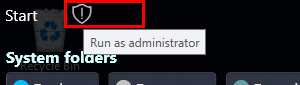
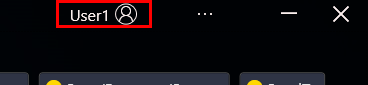
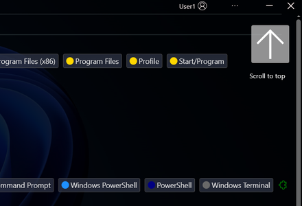
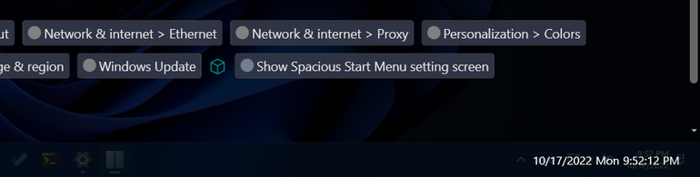
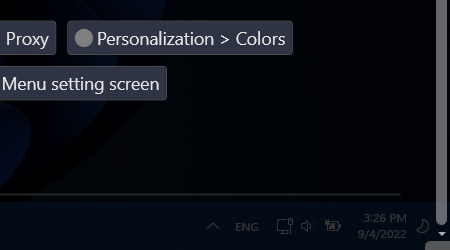
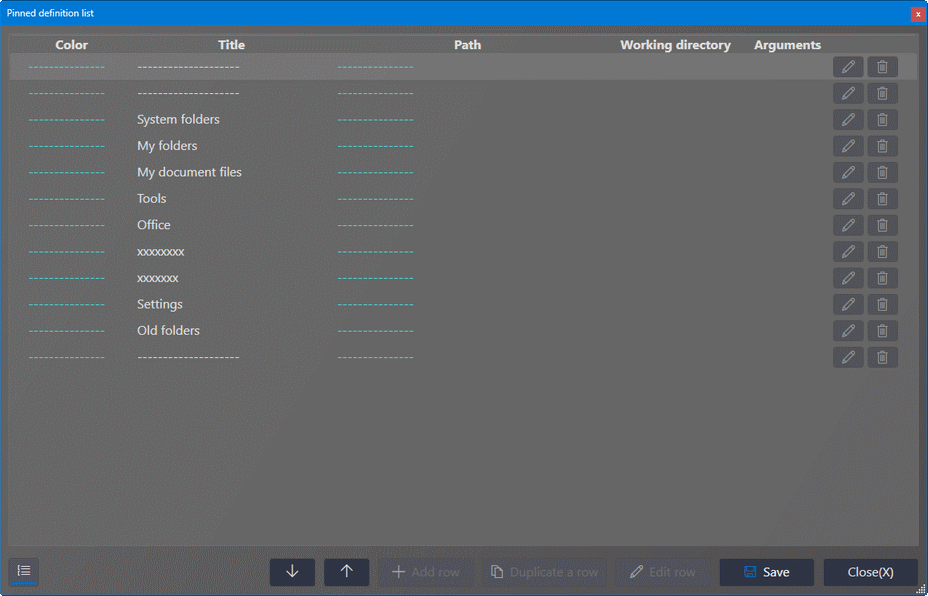
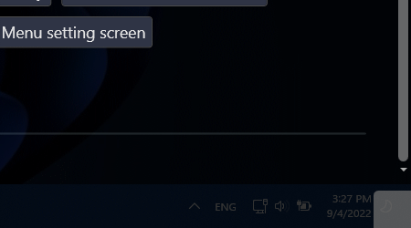

## Usage

Launch `SpaciousStartMenu.exe`. A sample launch button definition is generated on first launch.

Edit the launch button definition by right-clicking on the screen and choosing `Edit Pin`. This work is equivalent to pinning in the **Start Menu**.

Click the launch button to start an application, folder, etc.

- [1. Main screen](#1-main-screen)
  - [1.1. Overview](#11-overview)
  - [1.2. Context menu](#12-context-menu)
  - [1.3. Title bar](#13-title-bar)
  - [1.4. Zoom in/out](#14-zoom-inout)
  - [1.5. Mouse gestures](#15-mouse-gestures)
  - [1.6. Clock](#16-clock)
  - [1.7. Show desktop button](#17-show-desktop-button)
- [2. Pinned definition list screen](#2-pinned-definition-list-screen)
- [3. Pin edit screen](#3-pin-edit-screen)
  - [3.1. Overview](#31-overview)
  - [3.2. Color](#32-color)
  - [3.3. Special folders and environment variables](#33-special-folders-and-environment-variables)
  - [3.4. Special Commands](#34-special-commands)
  - [3.5. Landmark](#35-landmark)
- [4. Settings screen](#4-settings-screen)

### 🔷1. Main screen

#### 💠1.1. Overview

You can open a folder or start a program by pressing the launch button.

For executable programs, you can run them as an administrator by pressing the launch button while holding down `Ctrl` + `Shift`.

#### 💠1.2. Context menu

It is displayed by right-clicking the `...` button on the title bar or the margin other than the launch button.

| Menu item             | Description                                          |
| --------------------- | ---------------------------------------------------- |
| Edit Pin              | Displays the edit screen of the item to be launched. |
| Scale                 | Changes the display magnification of an item. You can also change the scale by rotating Ctrl + mouse wheel on the main screen. |
| Settings              | Displays the settings screen.                        |
| Open Program Location | Open the folder where this program is located.       |
| Open the program location and then exit the program | Open the folder where this program is located and exit the program. This menu item can be shown/hidden in the settings.       |
| View Help site              | View this web page.                        |

#### 💠1.3. Title bar

##### 🔹Modifier key status

While pressing a modifier key such as `Ctrl` or `Shift`, the mode valid for the key being pressed is displayed.
You can switch display/hide and display position on the setting screen.

##### 🔹Logged-in user

Shows currently logged in user. You can switch display/hide on the settings screen.
Click to sign out, shut down, or restart.

#### 💠1.4. Zoom in/out

You can zoom in/out by pressing the `+`, `-` buttons on the context menu or by holding down the `Ctrl` key and rotating the mouse wheel.

##### 🔹Zoom in

Largest view of Spacious Start Menu.

##### 🔹Zoom out

Smallest view of Spacious Start Menu.

#### 💠1.5. Mouse gestures

Move the mouse cursor up, down, left, or right while holding down the right mouse button, and release the right mouse button to launch the set function. Mouse gestures can be enabled/disabled on the settings screen.

#### 💠1.6. Clock

A clock can be displayed in the lower right corner. Display content and format can be changed in the settings screen.

#### 💠1.7. Show desktop button

At the bottom right there is a button to show the desktop.
It can be used instead of `Show desktop` on the taskbar.
The button size can be adjusted in the settings screen.

### 🔷2. Pinned definition list screen

This is a list of launch buttons, etc., displayed by `Edit Pin` in the context menu.

Double-click the list, click the edit icon at the right end of the list, or click the `Add Row` button or `Edit Row` button below to open the edit screen.

If you select the delete (trash can) icon on the far right or press the `Delete` key, the actual deletion will occur when the `Save` button is pressed.

To rearrange the order of the headings and the groups that belong to them, press the group rearrangement button on the bottom left.

### 🔷3. Pin edit screen

#### 💠3.1. Overview

Edit screen.

When `Headline` is selected, only `Title` can be entered.
If you want to draw a line to separate groups, select `Headline` and press the `Separator` button. The `Title` will be set to the string `--------------------` which will be recognized as a separator.

The `Path` field allows you to enter files and folders by drag & drop.

The `Working Directory` and `Arguments` are optional.

#### 💠3.2. Color

Color selection menu.

#### 💠3.3. Special folders and environment variables

Special folders and environment variables selection menu.

- [List of special folders](table.md#special-folders)
- [List of environment variables](table.md#environment-variables)

#### 💠3.4. Special Commands

Selecting `Special commands` will give you a choice of several commands that are not application launches. When you select a command from the choices, the `Title` is also set automatically, but can be changed to any name later.

- [List of special commands](table.md#special-commands)

##### 🔹Display example of special commands

#### 💠3.5. Landmark

Select `Landmark` to place a label for the emoji. Use it as a separator for launch buttons or as a landmark when looking for a button.

### 🔷4. Settings screen

#### 💠Setup

##### 🔹Register to startup

Register the Spacious Start Menu shortcut to the current user's startup.

##### 🔹Add a minimize launch option to the shortcut

Add the option to start in minimized state to the command line when registering a shortcut to startup.
This setting is unnecessary if `Start in minimized state` is enabled.

##### 🔹Remove from Startup

Remove the `Spacious Start Menu` shortcut from Startup.

##### 🔹Export settings

Outputs definitions of launch buttons and various settings to a file.

##### 🔹Import settings

Load the settings exported by the `Export settings` function.

#### 💠Minimize

##### 🔹Start in minimized state

Minimize when the application starts.

##### 🔹Minimize menu with Esc key

Causes the main screen to be minimized when the `Esc` key is pressed.

##### 🔹Minimize by double-clicking on the screen margin

Minimize the main screen when you double-click a part other than the startup button on the main screen.

##### 🔹Suppresses menu minimization when pressing the launch button while holding down the Ctrl key

Normally, pressing the launch button minimizes the main screen, but we don't want it to minimize when pressing the `Ctrl` key while pressing the launch button.

#### 💠Title bar

##### 🔹Show modifier key status on the title bar

While pressing a modifier key such as `Ctrl` or `Shift`, the title bar displays the mode that is valid for the key being pressed.

##### 🔹Show logged-in user in title bar

The name of the logged-in user is displayed in the upper right corner of the title bar.

#### 💠Launch button headline

##### 🔹Show sequential numbers in headings

Displays sequential numbers on group headings from top to bottom.

#### 💠Mouse gestures

##### 🔹Enable gestures

Enable mouse gestures.

You can assign commands to the gestures on the top, bottom, left, and right.

#### 💠Bottom area

##### 🔹Clock

The date, day of the week, and time are displayed in the lower right corner of the main screen.

##### 🔹Show desktop button

Specify the height and width of the **Show desktop** button at the bottom right of the main screen.

#### 💠Confirm

##### 🔹Confirm when exiting from the button on the title bar

A confirmation dialog is displayed when the close button on the upper right of the title bar is pressed.

#### 💠Context menu

##### 🔹Show `Open the program location and then exit the program` menu

In the context menu, display a menu item to open the folder where Spacious Start Menu is located in Explorer and then exit the program.

#### 💠Child screen

##### 🔹Save screen size

Save the size of each screen.

##### 🔹Save screen position

Save the position of each screen. The settings screen is always displayed in the center.

#### 💠Advanced options

##### 🔹Direct definition file edit button on the `Pinned definition list` screen

A button to switch to the mode for directly editing the definition file is displayed at the bottom left of the pinned definition list screen.

#### 💠About

Displays the version of Spatial Start Menu and the version of .NET runtime.

---

| [Index](index.md) | [Install](install.md) | [Update](update.md) | [Uninstall](uninstall.md) | Usage | [Other](other.md) |
