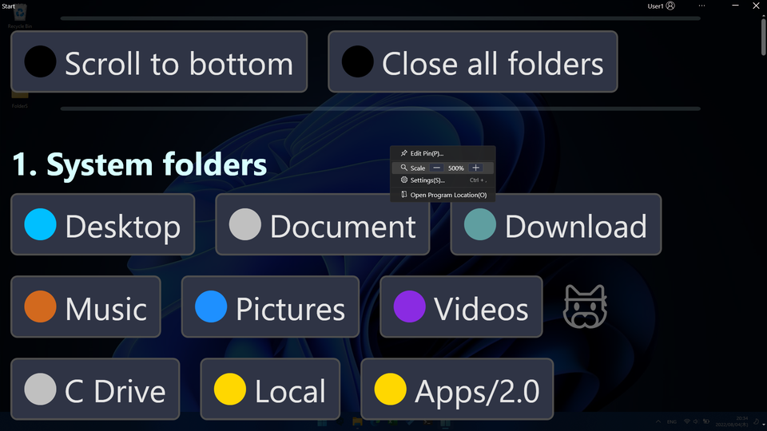
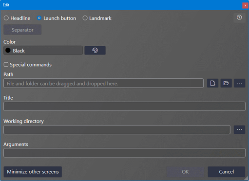
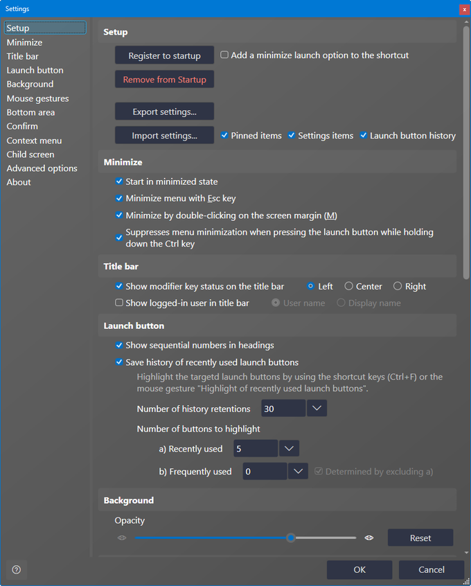

## Usage

Launch `SpaciousStartMenu.exe`. A sample launch button definition is generated on first launch.

Edit the launch button definition by right-clicking on the screen and choosing `Edit Pin`. This work is equivalent to pinning in the **Start Menu**.

Click the launch button to start an application, folder, etc.

- [Main screen](#main-screen)
- [Pinned definition list screen](#pinned-definition-list-screen)
- [Pin edit screen](#pin-edit-screen)
- [Settings screen](#settings-screen)

### 🔷Main screen

#### 💠Overview

You can open a folder or start a program by pressing the launch button.

For executable programs, you can run them as an administrator by pressing the launch button while holding down `Ctrl` + `Shift`.

#### 💠Context menu

It is displayed by right-clicking the `...` button on the title bar or the margin other than the launch button.

| Menu item             | Description                                          |
| --------------------- | ---------------------------------------------------- |
| Edit Pin              | Displays the edit screen of the item to be launched. |
| Scale                 | Changes the display magnification of an item. You can also change the scale by rotating Ctrl + mouse wheel on the main screen. |
| Settings              | Displays the settings screen.                        |
| Open Program Location | Open the folder where this program is located.       |
| Open the program location and then exit the program | Open the folder where this program is located and exit the program. This menu item can be displayed in the settings.       |

#### 💠Zoom in/out

You can zoom in/out by pressing the `+`, `-` buttons on the context menu or by holding down the `Ctrl` key and rotating the mouse wheel.

##### Zoom in

##### Zoom out

### 🔷Pinned definition list screen

This is the list screen displayed by `Edit Pin`.

Double-click the list, click the edit icon at the right end of the list, or click the `Add Row` button or `Edit Row` button below to open the edit screen.

If you select the delete (trash can) icon on the far right or press the `Delete` key, the actual deletion will occur when the `Save` button is pressed.

### 🔷Pin edit screen

#### 💠Overview

Edit screen.

When `Headline` is selected, only `Title` can be entered.
If you want to draw a line to separate groups, select `Headline` and press the `Separator` button. The `Title` will be set to the string `--------------------` which will be recognized as a separator.

The `Path` field allows you to enter files and folders by drag & drop.

The `Working Directory` and `Arguments` are optional.

#### 💠Color

Color selection menu.

#### 💠Special folders and environment variables

Special folders and environment variables selection menu.

|Special folder|Specification method|Examples of expanded values|
|:----|:----|:----|
|ApplicationData|`<ApplicationData>`|C:\Users\USER123\AppData\Roaming|
|CommonApplicationData|`<CommonApplicationData>`|C:\ProgramData|
|Cookies|`<Cookies>`|C:\Users\USER123\AppData\Local\Microsoft\Windows\INetCookies|
|DesktopDirectory|`<DesktopDirectory>`|C:\Users\USER123\Desktop|
|Favorites|`<Favorites>`|C:\Users\USER123\Favorites|
|Fonts|`<Fonts>`|C:\WINDOWS\Fonts|
|History|`<History>`|C:\Users\USER123\AppData\Local\Microsoft\Windows\History|
|InternetCache|`<InternetCache>`|C:\Users\USER123\AppData\Local\Microsoft\Windows\INetCache|
|LocalApplicationData|`<LocalApplicationData>`|C:\Users\USER123\AppData\Local|
|MyDocuments|`<MyDocuments>`|C:\Users\USER123\Documents|
|MyMusic|`<MyMusic>`|C:\Users\USER123\Music|
|MyPictures|`<MyPictures>`|C:\Users\USER123\Pictures|
|MyVideos|`<MyVideos>`|C:\Users\USER123\Videos|
|ProgramFiles|`<ProgramFiles>`|C:\Program Files|
|ProgramFilesX86|`<ProgramFilesX86>`|C:\Program Files (x86)|
|Programs|`<Programs>`|C:\Users\USER123\AppData\Roaming\Microsoft\Windows\Start Menu\Programs|
|SendTo|`<SendTo>`|C:\Users\USER123\AppData\Roaming\Microsoft\Windows\SendTo|
|StartMenu|`<StartMenu>`|C:\Users\USER123\AppData\Roaming\Microsoft\Windows\Start Menu|
|Startup|`<Startup>`|C:\Users\USER123\AppData\Roaming\Microsoft\Windows\Start Menu\Programs\Startup|
|System|`<System>`|C:\WINDOWS\system32|
|SystemX86|`<SystemX86>`|C:\WINDOWS\SysWOW64|
|UserProfile|`<UserProfile>`|C:\Users\USER123|
|Windows|`<Windows>`|C:\WINDOWS|

|Environment variable|Specification method|Examples of expanded values|
|:----|:----|:----|
|ALLUSERSPROFILE|`<ENV:ALLUSERSPROFILE>`|C:\ProgramData|
|APPDATA|`<ENV:APPDATA>`|C:\Users\USER123\AppData\Roaming|
|LOCALAPPDATA|`<ENV:LOCALAPPDATA>`|C:\Users\USER123\AppData\Local|
|PROGRAMDATA|`<ENV:PROGRAMDATA>`|C:\ProgramData|
|PROGRAMFILES|`<ENV:PROGRAMFILES>`|C:\Program Files|
|PROGRAMFILES(X86)|`<ENV:PROGRAMFILES(X86)>`|C:\Program Files (x86)|
|SYSTEMROOT|`<ENV:SYSTEMROOT>`|C:\WINDOWS|
|TEMP|`<ENV:TEMP>`|C:\Users\USER123\AppData\Local\Temp|
|TMP|`<ENV:TMP>`|C:\Users\USER123\AppData\Local\Temp|
|USERPROFILE|`<ENV:USERPROFILE>`|C:\Users\USER123|

#### 💠Special Commands

Selecting `Special commands` will give you a choice of several commands that are not application launches. When you select a command from the choices, the `Title` is also set automatically, but can be changed to any name later.

|Special commands|Specification method|Description|
|:----|:----|:----|
|System_Signout|`<CMD:System_Signout>`|Sign out|
|System_Shutdown|`<CMD:System_Shutdown>`|shut down|
|System_Restart|`<CMD:System_Restart>`|Restart|
|App_Minimized|`<CMD:App_Minimized>`|Minimize main screen|
|App_ZoomIn|`<CMD:App_ZoomIn>`|Zoom in main screen|
|App_ZoomOut|`<CMD:App_ZoomOut>`|Zoom out main screen|
|App_ScrollToTop|`<CMD:App_ScrollToTop>`|Scroll main screen to top|
|App_ScrollToBottom|`<CMD:App_ScrollToBottom>`|Scroll main screen to end|
|App_ScrollToUp|`<CMD:App_ScrollToUp>`|Scroll main screen up|
|App_ScrollToDown|`<CMD:App_ScrollToDown>`|scroll down the main screen|
|App_ReloadPinDefine|`<CMD:App_ReloadPinDefine>`|Reload launch button definition|
|Desktop_Show|`<CMD:Desktop_Show>`|show desktop|
|Settings_Show|`<CMD:Settings_Show>`|Show settings screen|
|Explorer_CloseAllFolders|`<CMD:Explorer_CloseAllFolders>`|Close all open folder windows in explorer|
|Explorer_ListFolders|`<CMD:Explorer_ListFolders>`|List open folder windows in explorer|
|Info_LaunchButtonCount|`<CMD:Info_LaunchButtonCount>`|Show the number of launch buttons|
|Info_GroupTitleCount|`<CMD:Info_GroupTitleCount>`|Show launch button's headline count|

Examples of special commands

#### 💠Landmark

Select `Landmark` to place a label for the emoji. Use it as a separator for launch buttons or as a landmark when looking for a button.

### 🔷Settings screen

#### 💠Setup

##### Register to startup

Register a shortcut on startup.

##### Add a minimize launch option to the shortcut

Add the option to start in minimized state to the command line when registering a shortcut to startup.
This setting is unnecessary if `Start in minimized state` is enabled.

##### Remove from Startup

Remove the shortcut from startup.

##### Export settings

Outputs definitions of launch buttons and various settings to a file.

##### Import settings

Load the settings exported by the `Export settings` function.

#### 💠Minimize

##### Start in minimized state

Minimize when the application starts.

##### Minimize menu with Esc key

Causes the main screen to be minimized when the `Esc` key is pressed.

##### Minimize by double-clicking on the screen margin

Minimize the main screen when you double-click a part other than the startup button on the main screen.

##### Suppresses menu minimization when pressing the launch button while holding down the Ctrl key

Normally, pressing the launch button minimizes the main screen, but we don't want it to minimize when pressing the `Ctrl` key while pressing the launch button.

#### 💠Title bar

##### Show modifier key status on the title bar

Displays the mode in the title bar while the `Ctrl` key or `Ctrl` + `Shift` key is pressed.

##### Show logged-in user in title bar

The name of the logged-in user is displayed in the upper right corner of the title bar.

#### 💠Launch button headline

##### Show sequential numbers in headings

Displays sequential numbers on group headings from top to bottom.

#### 💠Confirm

##### Confirm when exiting from the button on the title bar

A confirmation dialog is displayed when the close button on the upper right of the title bar is pressed.

#### 💠Context menu

##### Show `Open the program location and then exit the program` menu

In the context menu, display a menu item to open the folder where `Spacious Start Menu` is located in Explorer and then exit the program.

#### 💠Child screen

##### Save screen size

Save the size of each screen.

##### Save screen position

Save the position of each screen.

#### 💠Advanced options

##### Direct definition file edit button on the `Pinned definition list` screen

A button to switch to the mode for directly editing the definition file is displayed at the bottom left of the pinned definition list screen.

#### 💠About

Displays the version of `Spatial Start Menu` and the version of .NET runtime.

---

| [Index](index.md) | [Install](install.md) | [Update](update.md) | [Uninstall](uninstall.md) | Usage | [Other](other.md) |
