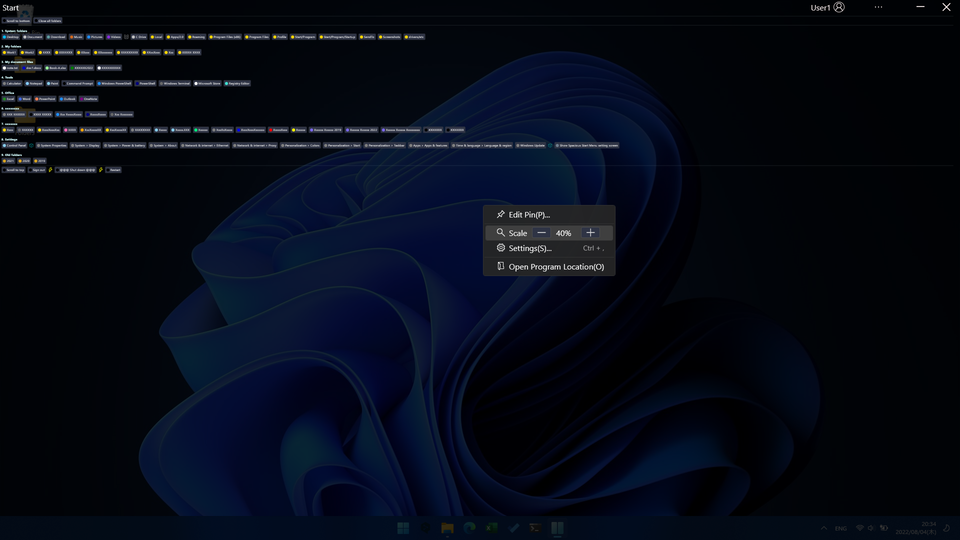
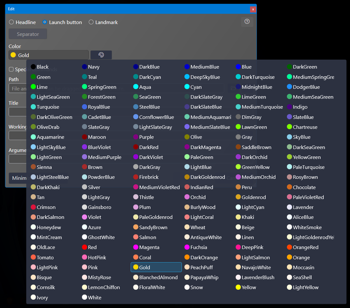

# Usage

Launch `SpaciousStartMenu.exe`.

Right-click on the screen and select `Edit Pinning` to add a definition.

Launch defined applications, folders, etc. at the click of a button.

- [Main screen](#main-screen)
- [Pinned definition list screen](#pinned-definition-list-screen)
- [Pin edit screen](#pin-edit-screen)
- [Settings screen](#settings-screen)

## 🔷Main screen

You can open a folder or start a program by pressing the launch button.

For executable programs, you can run them as an administrator by pressing the launch button while holding down `Ctrl` + `Shift`.

### 💠Context menu

It is displayed by right-clicking the `...` button on the title bar or the margin other than the launch button.

| Menu item             | Description                                          |
| --------------------- | ---------------------------------------------------- |
| Edit Pin              | Displays the edit screen of the item to be launched. |
| Scale                 | Changes the display magnification of an item. You can also change the scale by rotating Ctrl + mouse wheel on the main screen. |
| Settings              | Displays the settings screen.                        |
| Open Program Location | Open the folder where this program is located.       |
| Open the program location and then exit the program | Open the folder where this program is located and exit the program. This menu item can be displayed in the settings.       |

### 💠Zoom in/out

You can zoom in/out by pressing the `+`, `-` buttons on the context menu or by holding down the `Ctrl` key and rotating the mouse wheel.

#### Zoom in

#### Zoom out

## 🔷Pinned definition list screen

This is the list screen displayed by `Edit Pin`.

Double-click the list, click the Edit button on the far right, or click the `Add row` button to open the edit screen.

If you select the delete (trash can) icon on the far right or press the `Delete` key, the actual deletion will occur when the `Save` button is pressed.

## 🔷Pin edit screen

Edit screen.

When `Headline` is selected, only `Title` can be entered.
If you want to draw a line to separate groups, select `Headline` and press the `Separator` button. The `Title` will be set to the string `--------------------` which will be recognized as a separator.

The `Path` field allows you to enter files and folders by drag & drop.

The `Working Directory` and `Arguments` are optional.

Color selection menu.

Special folders and environment variables selection menu.

Selecting `Special command` will give you a choice of several commands that are not application launches. When you select a command from the choices, the `Title` is also set automatically, but can be changed to any name later.

## 🔷Settings screen

---

| [Index](index.md) | [Install](install.md) | [Update](update.md) | [Uninstall](uninstall.md) | Usage | [Other](other.md) |
